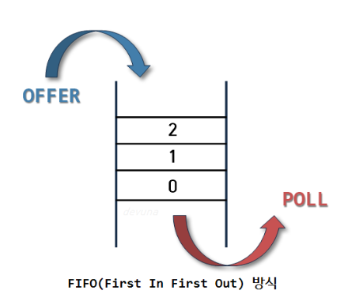

### 개념

한 방향 흐름대로 데이터가 들어가고 나가는 형태 입구와 출구가 다르다

FIFO ( FIRST-IN FIRST-OUT ) : 선입 선출 ⇒ 먼저 들어간 데이터가 먼저 접근된다.

### 특징

- rear ( 끝 ) 에서 삽입연산
- front ( 앞 ) 에서 삭제연산
- 데이터 처음은 front , 끝은 rear
- rear와 front 로만 데이터 접근
- queue data 넣는 것은 enqueue , 삭제하는 것을 dequeue 라고 한다.

### Queue 예시

- 은행업무
- 인쇄 리스트